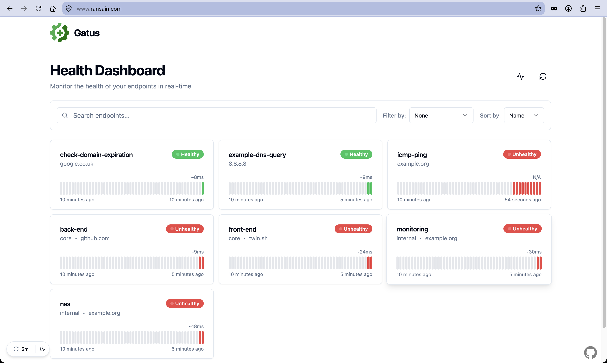
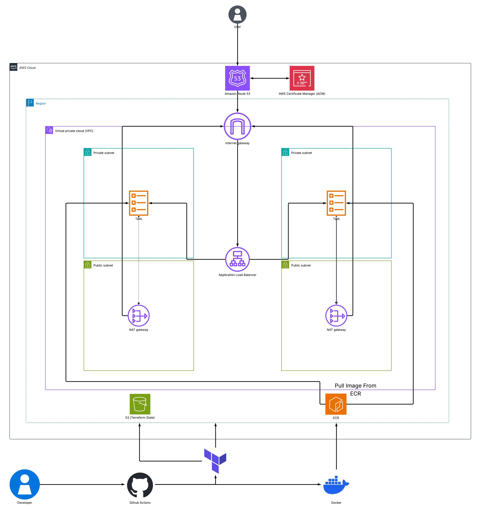
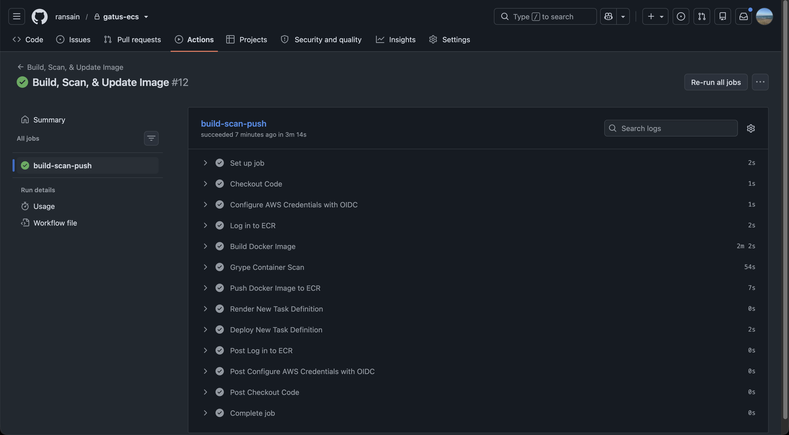
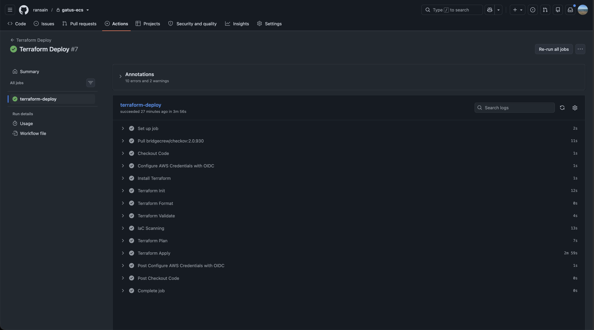
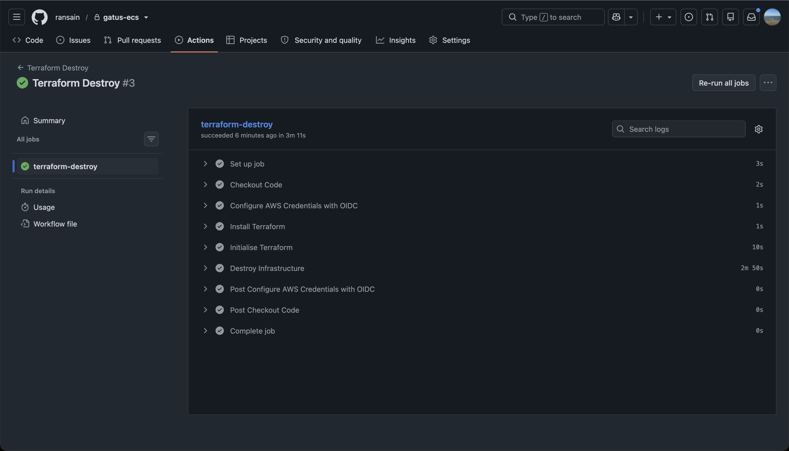

# Gatus App ECS Fargate

## Overview

This project deploys Gatus, an application for endpoint health monitoring, running on AWS ECS Fargate and deployed with Docker, with the Infrastructure created and modularised via Terraform, and CI/CD to automate the process, while following real DevOps practices

---

## Live App



---

## Architecture



---

## Repository Structure
```
gatus-ecs/
│
├── .github/
│   └── workflows/
│       ├── build-and-push.yml
│       ├── terraform-deploy.yml
│       └── terraform-destroy.yml
│
├── app/
│   └── Dockerfile
│
├── infra/
│   ├── main.tf
│   ├── provider.tf
│   ├── variables.tf
│   │
│   └── modules/
│       ├── acm/
│       ├── alb/
│       ├── ecr/
│       ├── ecs/
│       ├── route53/
│       └── vpc/
│
├── .gitignore
│
└── README.md
```

---

## Local Development

(Docker must be installed)

```
git clone https://github.com/ransain/gatus-ecs.git
cd /app
docker build -t gatus .
docker run -p 8080 -d gatus:latest

Then visit
http://localhost:8080
```

---

## CI/CD

#### Build & Push Pipeline
- Creates a Docker image of the application with a SHA commit tag
- Runs a Grype scan for identifying vulnerabilities 
- Pushes the image to ECR and updates the task definition



#### Deploy Pipeline
- Initialises Terraform and configure remote backend (S3)
- Runs linting, formatting, and validation checks
- Plan & Apply the infrastructure to deploy to AWS



#### Destroy Pipeline
- Tears down all the infrastructure safely

